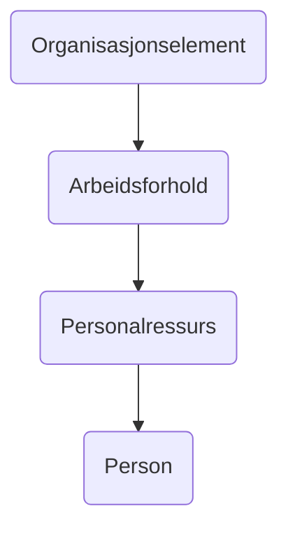

# FINT HR Integration

FINT is a REST API that provides access to data in business systems from the Norwegian public sector. The API is based
on the FINT data model and provides access to data such as employees, positions, and organizations.

Vigilo provides an integration with FINT that allows you to synchronize HR data to Vigilo.

## FINT main classes (hovedklasser) and attributes used in the integration

This integration starts by fetching the organizations specified in the Vigilo configuration. For each organization it
fetches all the positions (arbeidsforhold). For each position it fetches the employee (personalressurs) and for each
employee it fetches the person (person).



### Organisasjonselement (Organization)

No attributes are mapped from this class. We only use it to get employments (arbeidsforhold) for the organization.

### OAS Position (stilling) entity -> FINT Arbeidsforhold entity

You can find information from **_FINT arbeidsforhold_** in the **_Ansattkort_** in OAS.

| Vigilo OAS                  | FINT                                          |
|-----------------------------|-----------------------------------------------|
| `stilling.fra og med`       | `arbeidsforhold.gyldighetsperiode.start`      |
| `stilling.til og med`       | `arbeidsforhold.gyldighetsperiode.slutt`      |
| `stilling.hovestilling`     | `arbeidsforhold.hovedstilling`                |
| `stilling.stillingsnummer`  | `arbeidsforhold.stillingsnummer`              |
| `stilling.stillingsprosent` | `arbeidsforhold.ansettelsesprosent`           |
| `stilling.stillingskode`    | `stillingskode.kode` and `stillingskode.navn` |
| `stilling.stillingstype`    | `arbeidsforholdstype.navn`                    |

### OAS Employee (ansatt) entity -> FINT Personalressurs entity

You can find information from **_FINT personalressurs_** in the **_Ansattkort_** in OAS.

| Vigilo OAS                        | FINT                                                   |
|-----------------------------------|--------------------------------------------------------|
| `ansattinformasjon.ansattnummer`  | `personalressur.ansattnummer`                          |
| `ansattinformasjon.fra og med`    | `personalressur.ansettelsesperiode.start`              |
| `ansattinformasjon.til og med`    | `personalressur.ansettelsesperiode.slutt`              |
| `ansattinformasjon.alias`         | `personalressur.brukernavn.identifikatorverdi`         |
| `ansattinformasjon.e-post`        | `personalressur.kontaktinformasjon.epostadresse`       |
| `ansattinformasjon.telefonnummer` | `personalressur.kontaktinformasjon.mobiltelefonnummer` |

### OAS Person (person) entity -> FINT person entity

You can find information from **_FINT person_** in the **_Ansattkort_** in OAS.

| Vigilo OAS                  | FINT                                 |
|-----------------------------|--------------------------------------|
| `personalia.fødselsnummer`  | `person.fodselsnummer`               |
| `personalia.fornavn`        | `person.navn.fornavn`                |
| `personalia.etternavn`      | `person.navn.etternavn`              |
| `personalia.fødselsdato`    | `person.fodselsdato`                 |
| `personalia.kjønn`          | `person.kjonn`                       |
| `bostedsadresse.adresse`    | `person.bostedsadresse.adresselinje` |
| `bostedsadresse.poststed`   | `person.bostedsadresse.poststed`     |
| `bostedsadresse.postnummer` | `person.bostedsadresse.postnummer`   |
| `postadresse.adresse`       | `person.postadresse.adresselinje`    |
| `postadresse.poststed`      | `person.postadresse.poststed`        |
| `postadresse.postnummer`    | `person.postadresse.postnummer`      |

## Setup

### Authentication and access in FINT

This integration needs a FINT client with access to the following components:

* `Administrasjon Organisasjon`
* `Administrasjon Personal`
* `Administrasjon Kodeverk`

### How to configure organisasjonslementer to include in the integration

The integration fetches all the organizations in FINT specified in the Vigilo configuration. This is configured in the
**_Enhet_** section of the school. For each FINT `organisasjonselement` you want to import, you need to specify the
`organisasjonsId` value from FINT.

```json
{
  "organisasjonsnavn": "Skolenavnet",
  "organisasjonsId": {
    --> "identifikatorverdi": "12543"
  },
  "organisasjonsKode": {
    "identifikatorverdi": "009988"
  },
  "_links": {
    ...
  },
  ...
}
```

